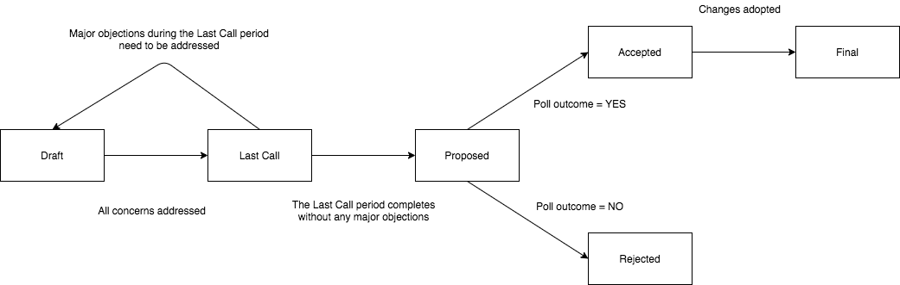

## Abstract

LIP stands for Livepeer Improvement Proposal. A LIP is a design document that either describes a new feature for the Livepeer protocol or the processes and environment used for
developing it, or provides information to the Livepeer community. The LIP should provide a concise technical specification of the feature and the rationale for the feature.
The LIP author is responsible for building consensus within the community and documenting dissenting opinions.

## Motivation

LIPs are meant to be the primary mechanism for propsing new features, for collecting community input on an issue, and for documenting the design decisions made in
developing the Livepeer protocol. LIPs are maintained as text files in a versioned repository and as a result each proposal has an associated historical record with all
past revisions.

LIPs can be used to track the progress of a client implementation and its compatibility with the current version of the Livepeer protocol. Implementers can list LIPs that
have been implemented in a particular client.

The LIP process is a pre-processing step for proposals prior to the creation of a poll about the proposal. While a poll can be created for a proposal that does not go through the LIP process the hope is that the LIP process can establish a quality standard for proposals such that proposals that do not go through the LIP process will have a lower probability of being accepted relative to proposals that do go through the LIP process.

## Specification

### LIP Types

There are three types of LIPs:

- A **Standard Track LIP** describes any changes that affect the Livepeer protocol. Currently, these changes are focused around the Ethereum smart contracts and clients
that interact with the contracts. However, in the future Standard Track LIPs may be further categorized to capture other components of the Livepeer protocol such as
the networking protocol.
- A **Parameter LIP** describes an update to protocol contract parameters. These parameters can be updated via parameter setter functions defined on the protocol contracts
- An **Informational LIP** provides general guidelines or information to the Livepeer community, but does not propose a new feature. Informational LIPs do not
necessarily represent Livepeer community consensus or a recommendation, so users and implementers are free to ignore Informational LIPs or follow the outlined advice.
- A **Meta LIP** describes processes surrounding Livepeer including proposals to change processes. Examples of processes that could be described in Meta LIPs are
decision-making processes used in the governance around future Livepeer protocol upgrades and tools/environments used in Livepeer development.

### LIP Statuses

- **Draft**: a LIP that is open for consideration.
- **Last Call**: a LIP that has undergone sufficient discussion/iteration and is in the final period for comments prior to being the subject of a poll.
- **Proposed**: a LIP that is ready to be the subject of a poll.
- **Abandoned**: a LIP that has either been inactive for a period of time or that no longer has a champion (the previous champion(s) can indicate that they are no longer pursuing this LIP and request for it be marked as Abandoned).
- **Accepted**: a LIP that is planned for immediate adoption (i.e. expected to be included in an upcoming protocol upgrade). An LIP is assigned this status if it is the subject of a poll and the poll result is yes.
- **Rejected**: a LIP that is not being considered for immediate adoption, and will not be reconsidered in the future for a subsequent protocol upgrade. An LIP is assigned this status if it is the subject of a poll and the poll result is no.
- **Final**: a LIP that has been adopted in a previous protocol upgrade.

### LIP Header Preamble

Each LIP must begin with a header preamble. The following fields are REQUIRED:

```
lip
title
author
type
status
created
discussions-to
```

The following fields are OPTIONAL:

```
requires
replaces
part-of
```

The **discussions-to** field includes the URL where the LIP should be discussed. Examples of appropriate public forums to use for LIP discussion include [the issues for this repository](https://github.com/livepeer/LIPs/issues) and [the Livepeer forum](https://forum.livepeer.org/).

The **part-of** field includes the number of the parent LIP that this LIP is a part of. If a LIP is a part of a parent LIP (perhaps because the author wishes to have the community consider a bundle of LIPs together) then a poll should not be created for the LIP once it is assigned the Proposed status and a poll should only be created for the parent LIP.

Refer to [LIP-X](../LIP-X.md) for more information on each of these fields.

### LIP Work Flow

The following diagram describes the path to adoption for a LIP:



The LIP repository editors change the status of LIPs.

The LIP process begins with a new idea for the Livepeer protocol. LIPs should be as focused as possible such that they contain a single key proposal or new idea.
The LIP editor reserves the right to reject LIP proposals if they appear to be unfocused or too broad.

Each LIP must have a champion - someone who writes the LIP using the appropriate style and format, shepherds discussions in the appropriate forums, and attempts to build
community consensus around the proposed idea.

Parties interested in submitting a LIP are encouraged to vet an idea publicly before actually writing the proposal to save time and to ensure that the idea presented is
applicable to the entire Livepeer community. Examples of appropriate public forums to gauge interest around an LIP include [the issues for this repository](https://github.com/livepeer/LIPs/issues), [the Livepeer forum](https://forum.livepeer.org/), [the Livepeer Discord channels](https://discord.gg/7wRSUGX) and [the Livepeer subreddit](https://www.reddit.com/r/livepeer).

After receiving feedback from the community and refining the technical language around an idea, a draft LIP should be submitted as [pull request](https://github.com/livepeer/LIPs/pulls).

If the LIP editors approve the LIP and the author is happy with the draft being merged, the LIP editors will assign the LIP a number and merge the LIP as a draft.

Once a draft LIP is merged, additional changes to the draft may be submitted as pull requests until the author believes the LIP is mature enough for the next phase. Some LIPs (such as this one) are meant to be continually updated in the future and will remain in the Draft status. 

#### The Last Call Period

An LIP champion(s) can open a PR to request that a LIP to be assigned the Last Call status, but the LIP editors are responsible for assessing whether all concerns have been addressed prior to assigning the Last Call status by approving and merging the PR.

The Last Call period should typically be 10 days to give stakeholders ample time to voice objections and to request changes prior the LIP being the subject of a poll. During this time, the LIP should be publicized in various communication channels such as Discord, the forum, blog posts, etc. The rationale behind targeting 10 days for the Last Call period is that it allows someone to go offline for a week (i.e. for vacation) and still have time after returning to review the LIP before the end of the Last Call period.

#### Poll Usage

After a LIP is assigned the Proposed status a poll should be created for the LIP (unless the LIP is a part of a [bundle](#bundling-lips)) using the system described in [LIP-16](LIP-16.md). If the result of the poll is yes, the LIP is assigned the Accepted status. If the result of the poll is no, the LIP is assigned the Rejected status.

When a LIP is assigned the Accepted status, the expectation is that it will be immediately adopted and any required on-chain updates mentioned in the LIP should be executed by the core team. While the use of a poll is only required to move a LIP from the Proposed status to the Accepted or Rejected status, a poll can also be used to gauge sentiment around a LIP earlier in the process. Any poll created for a LIP that is not assigned the Proposed status can be considered a sentiment poll. These types of polls may be useful for assessing the chance of an LIP eventually being adopted before investing a large amount of resources for implementation and testing. The decision of whether to create a sentiment poll earlier in the process is up to the LIP champion(s).

The champion(s) of a LIP is typically expected to create a poll if the LIP is assigned the Proposed status, but the poll can also be created by someone else.

#### Bundling LIPs

If there is a desire to consider multiple LIPs in a single bundle (i.e. for a scheduled protocol upgrade with multiple changes) then all LIPs in the bundle need to:

- Specify the parent LIP that they are a part of using the **part-of** field in the LIP header preamble.
- Be assigned the Proposed status.

The parent LIP for a bundle needs to:

- Reference each of the LIPs in the bundle.
- Be assigned the Proposed status.

Once the parent LIP is assigned the Proposed status, a poll can be created for it. From here, the following outcomes are possible:

- The parent LIP is assigned the Accepted status. Each of the individual LIPs referenced by the parent LIP would also be assigned the Accepted status.
- The parent LIP is assigned the Rejected status. Each of the individual LIPs referenced by the parent LIP would remain in the Proposed status. If there is a desire to consider an individual LIP standalone at this point, the LIP champion can remove the **part-of** field.

#### Finalizing LIPs

After an Accepted LIP is included in a scheduled protocol upgrade the LIP is designated as Final.

### LIP Formats and Templates

LIPs should be written in [markdown](https://github.com/adam-p/markdown-here/wiki/Markdown-Cheatsheet) format. [This template](../LIP-X.md) should be used for every
new LIP.

## Specification Motivation

The structure of this LIP process is heavily inspired by [Ethereum's EIP-1](https://github.com/ethereum/EIPs/blob/master/EIPS/eip-1.md). The goal is to use this structure
as a foundational starting point from which the LIP process can evolve with the needs of the Livepeer community.

This LIP was updated after [LIP-15](LIP-15.md) was assigned the Final status.

## Copyright

Copyright and related rights waived via [CC0](https://creativecommons.org/publicdomain/zero/1.0/).
