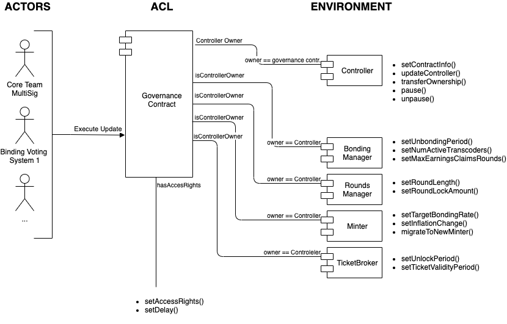

## Abstract

This proposal describes an extensible governance system that can be used to update the parameters and code of the Livepeer protocol smart contracts and establish a basis for a clear upgrade path for the governance system to give stakeholders control over the system.

## Motivation

At the moment, a core developer owned multisig has admin privileges over the Livepeer protocol, giving the core developers the ability to update contract code and parameters.

The goal for an extensible governance contract is to establish the technical foundation that allows for a variety of sophisticated binding voting systems to be implemented in the future.

After deployment, ownership of the Controller contract will be transferred to the extensible governance contract which will still have a core developer owned multisig as it's main and only actor until control can be phased to binding voting systems in later milestones of the governance roadmap. 

From a high level this extensible governance system should fulfill following properties: 
- Enable on-chain access rights allowing particular actors to execute (particular) code/parameter updates
- Allow future changes to the governance structure
- Enable on-chain rules for how code/parameters can be updated, e.g. delayed execution.
- Facilitate atomic execution of multiple upgrades


## Specification

The extensible governance system will be a Smart Contract deployed on the Ethereum blockchain consisting of following components
- Access Control List
- Staged Execution
- Batched Execution

### Access Control List

The Access Control List contains rules that grant or deny access to certain actors to execute code/parameter updates in the Livepeer protocol.

This mechanism grants access based on Ethereum addresses, whether that be an EOA, smart contract or multisig. The access rights can be for either the entire scope of the protocol or modular (cfr. root and users). 




**Example Implementation**

An example implementation could bind actors other than `owner` to contract methods at specific target addresses. E.g. _Binding Voting System 1_ is allowed to call `setRoundLength()`on the `RoundsManager` and `setUnbondingPeriod()` on the `BondingManager`. 

```solidity
contract ACL is Ownable {

    /// @dev Actor => Contract => Function signature
    mapping(address => mapping(address => mapping(bytes4 => bool))) _accessRights;

    /**
    * @dev check whether msg.sender has access rights to execute '_data' at '_target'
    * @param _actor actor to check rights for
    * @param _target target contract address
    * @param _method 4-byte identifier of the method
    * @return true/false whether 'msg.sender' has sufficient rights
    */
    function accessRights(address _actor, address _target, bytes4 _method) public view returns (bool) {
        return _actor == owner || _accessRights[_actor][_target][_method];
    }

    /**
    * @dev set access rights for for an Ethereum address
    * @param _actor ethereum address to grant access rights
    * @param _target target contract address '_actor' is allowed to call
    * @param _methods list of methods on '_target' contract the '_actor' is allowed to call
    * @param _access list of booleans indicating access rights corresponding to the list of '_methods'
    */
    function setAccessRights(address _actor, address _target, bytes4[] memory _methods, bool[] memory _access) public {
        // Check that 'msg.sender' has sufficient rights to alter ACL rules
        require(accessRights(msg.sender, address(this), getMethodSignature(msg.data)), "access denied");
        for (uint256 i = 0; i < _methods.length; i++) {
            _accessRights[_actor][_target][_methods[i]] = _access[i];
        }
    }

    function getMethodSignature(bytes memory _data) public pure returns (bytes4 method) {
        assembly {
            method := mload(add(_data, 0x20))
        }
    }
}
```


### Staged Updates & Delayed Execution

One potential rule for the governance contract to establish is a **time delay for executing governance actions** to give all stakeholders a clear view on pending updates and to allow those who disagree with the update to exit the protocol prior to execution of the update.  Updates can be stored as state on-chain before execution providing transparency for stakeholders. Governance actions can be parameter updates, code changes, updating access rights or updating time delay. 

Time delay can be defined by a parameter, `DELAY`: Number of blocks by which to delay execution of a staged update.

`DELAY` can be either a global or modular parameter, some benefits for a modular parameter, e.g. per actor basis/per function basis, include:
- facilitate longer delays for 'sensitive' updates
- allow quicker updates by the core team in the initial stage
- enable more dynamic protocol pausing/unpausing mechanics (e.g. core team can still initially pause on a very small delay but community can submit a proposal to unpause again on a longer delay)

The exact implementation is still open for discussion but there's several options:
- Role-based access control 
- Simple nested map: `map[function sig]map[address]delay`

```solidity
contract Staging is ACL {
    
    struct Update {
        address target;
        bytes data;
    }
    
    struct StagedUpdate {
        Update[] updates;
        uint256 timelock;
    }

    /// @dev UpdateStaged is emitted when an actor stages an update
    event UpdateStaged(address indexed actor, uint256 id, StagedUpdate stagedUpdate);
    
    /// @dev delays per actor
    mapping(address => uint256) delays;
    /// @dev staged updates
    mapping(uint256 => StagedUpdate) public stagedUpdates;
    /// @dev current update count
    uint256 public updateCount;
    
    /**
    * @dev stage an update for future execution.
    * @param _updates a list of updates to be executed.
    * @notice The entity staging the update must be allowed.
    */
    function stageUpdate(Update[] memory _updates) public {
        StagedUpdate storage stagedUpdate = stagedUpdates[updateCount];
        for (uint256 i = 0; i < _updates.length; i++) {
            require(accessRights(msg.sender, _updates[i].target, getMethodSignature(_updates[i].data)), "access denied");
            stagedUpdate.timelock = block.number + delays[msg.sender];
            stagedUpdate.updates.push(Update({target: _updates[i].target, data: _updates[i].data}));
        }
        emit UpdateStaged(msg.sender, updateCount, stagedUpdate);
        updateCount++;
    }
    
    /**
     * @dev set a update execution time delay for an actor
     * @param _actor ethereum address of the actor to set a delay for
     * @param _delay number of blocks to delay updates for
     * @notice will revert if 'msg.sender' is not authorized to call this method
     */
    function setDelay(address _actor, uint256 _delay) public {
        require(accessRights(msg.sender, address(this), getMethodSignature(msg.data)), "access denied");
        if (_delay == 0) {
            delete delays[_actor];
        } else {
            delays[_actor] = _delay;
        }
    }
}
```
### Batched Execution

Batched execution allows multiple code/parameter updates to be bundled into a single on-chain action. This can reduce the complexity and number of steps required for a protocol upgrade that consists of multiple proposals/changes.

Since each parameter change is essentially a contract method call, the raw transaction data can be calculated before actually submitting the transaction to the target contract. Updates can then be executed as a batch as long as the combined set of method calls does not exceed the Ethereum block gas limit. 

```solidity
contract Execution is ACL, Staging {
    
    /// @dev UpdateExecuted is emitted when a staged update has been fully executed
    event UpdateExecuted(address indexed actor, StagedUpdate update);
    
    /**
    * @dev Execute a staged update.
    * @notice Updates are authorized during staging.
    * @notice Reverts if a transaction can not be executed.
    * @param  _id id of the staged update.
    */
    function executeUpdate(uint256 _id) public {
       StagedUpdate storage stagedUpdate = stagedUpdates[_id];
       require(block.number > stagedUpdate.timelock, "time delay for update not expired");
        for (uint256 i = 0; i < stagedUpdate.updates.length; i++) {
            (bool success,) = stagedUpdate.updates[i].target.call(stagedUpdate.updates[i].data);
            require(success, "could not execute update");
        }
        emit UpdateExecuted(msg.sender, stagedUpdate);
        delete stagedUpdates[_id];
    }
}
```

### EthFiddle

The prototype contracts are available at https://ethfiddle.com/2iCPShA1pv

### Upgrade Path

The governance contract's design rationale should establish a clear technical foundation to lay the groundwork for an upgrade path to give control over protocol code/parameters to the stakeholders. This section provides an example of what such an upgrade path might look like without setting explicit milestones. 

1. Deploy governance contract with the core team multisig as `owner`. 
2. Make core team multisig subject to a time delay for most actions (e.g. it might still be interesting to allow the core team to retain the right to pause/unpause the protocol in the early stages)
3. Grant access to a binding voting system to alter less sensitive protocol parameters
4. Hand over control of all protocol parameters to binding voting systems
5. Allow binding voting systems to execute code updates
6. Deploy a binding voting system to govern the governance contract's ACL
7. Remove core team multisig as `owner` and have ACL rules be established by a binding voting system

**In scope** For this proposal would be **step 1** and **step 2**

Step 1 would be completed upon deployment of the Extensible Governance System. Step 2 will be decided by the outcome of the initial values discussion [here](https://github.com/livepeer/LIPs/issues/30). 


## Specification Rationale

A modular ACL list that is actor agnostic allows for maximum extensibility to the governance structure and abstracts any details of how a binding voting systems should look like. It merely sets the foundation through which different actors can execute updates to protocol code or parameters. 

It further enables different types of actors or different types of voting systems to have control over different parts of the protocol. Different parameters might require different systems, e.g. higher `QUORUM` and `THRESHOLD` values or  different voting schemes than tokenholder voting.

Facilitating executing batches of staged updates simplifies the upgrade path for both EOA and contract actors and provides full transparency to all stakeholders as to all staged updates, their actors and time delay. 

A modular ACL and time delay allows for interesting mechanics and a clear governance upgrade path to hand control over to binding voting systems. The core team can initially retain `owner` access over the protocol contracts but updates subject to the LIP process can already be subject to a time delay as well. In future milestones control over certain parameters or code updates can be phased over to the community through a binding voting system. 

## Initial Parameter Values

There's mainly two initial values that need to be set 

- The initial `OWNER` 
- The `DELAY` for the first actor, if applicable 

It's established already that the first actor of this governance system will be the Livepeer Inc Multisig. Additional actors can be added over time through the Livepeer Governance process. 

`OWNER=0x04746b890d090ae3c4c5df0101cfd089a4faca6c`

The `DELAY` parameter, when opting for a modular or role-based system can differ based on the action being taken. 
To separate design and initial value discussions a proposal for the initial values can be found [here](https://github.com/livepeer/LIPs/issues/30)

## Additional Context

- Initial `DELAY` parameter discussion thread: https://github.com/livepeer/LIPs/issues/30

## Copyright

Copyright and related rights waived via [CC0](https://creativecommons.org/publicdomain/zero/1.0/).
