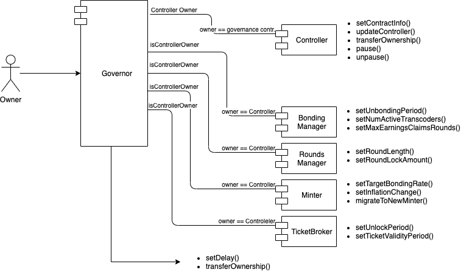

## Abstract

This proposal is the next step towards **decentralising ownership over the Livepeer protocol** and fulfills the second milestone of the [Livepeer Governance Roadmap](https://medium.com/livepeer-blog/livepeer-governance-roadmap-proposal-69a6e9e33f80). It transfers ownership of the Livepeer protocol to a smart contract which in a later milestone can be owned by a binding voting system. It is a clear step forward in transferring control over the Livepeer protocol from the core team to all stakeholders (tokenholders, orchestrators, broadcasters, ... ).

This LIP offers **complete transparency** around changes being made to the Livepeer protocol and the ability for the community or individual stakeholders to object to changes or exit the protocol if they don't agree with the changes being made or if changes are executed in bad faith. These new transparancy properties further **strengthens the social contract** that is implicitly established between the stakeholders and the core team executing the changes.

The motivation behind this milestone is not to immediately implement a sophisticated binding voting system, but rather to establish the **technical foundation that allows for a variety of sophisticated binding voting systems to be implemented in the future**.


## Motivation

At the moment, a core developer owned multisig has admin privileges over the Livepeer protocol, giving the core developers the ability to update contract code and parameters.

The goal for an extensible governance contract is to establish the technical foundation that allows for a variety of sophisticated binding voting systems to be implemented in the future.

After deployment, ownership of the Controller contract will be transferred to the extensible governance contract which will still have a core developer owned multisig as it's main and only actor until control can be phased to binding voting systems in later milestones of the governance roadmap. 

From a high level this extensible governance system should fulfill following properties: 
- Enable on-chain access rights allowing particular actors to execute (particular) code/parameter updates
- Allow future changes to the governance structure
- Enable on-chain rules for how code/parameters can be updated, e.g. delayed execution.
- Facilitate atomic execution of multiple upgrades


## Specification

The extensible governance system will be a Smart Contract deployed on the Ethereum blockchain consisting of following components
- Access Control
- Staged Execution
- Batched Execution


### Types

```solidity
struct Update {
    address[] target;
    uint256[] value;
    bytes[] data;
    uint256 nonce;
}
```

### Global State

```solidity
    /// @dev authorized address to stage updates
    address public owner;

    /// @dev mapping of updateHash (keccak256(update) => executeBlock (block.number + delay)
    mapping(bytes32 => uint256) updates; 

```

### Access Modifiers

#### onlyThis

Functions with the `onlyThis` modifier can only be called by the `Governor` contract itself. 

```
require(msg.sender == address(this), "unauthorized: msg.sender not Governor")
```

#### onlyOwner

Functions with the `onlyOwner` modifier require `msg.sender` to be equal to `owner`. 

```
require(msg.sender == owner, "unauthorized: msg.sender not owner");
```

### API

#### `owner() returns (address)`

Returns the address of the current owner of the Governance contract.

#### `transferOwnership(address newOwner) onlyThis` 

Transfers the ownership of the Governance contract to a different address. While this function is available on the public API it can only be called by the contract `owner` through the `stage()` & `execute()` mechanism. 

#### `stage(Update memory _update, uint256 _delay) onlyOwner`

Stage an update for execution, can consist of multiple separate updates to be executed atomically as a batch. The updates have to be staged by the contract `owner`. 

Staged updates are not stored on-chain. Instead the hash of the update, `bytes32 updateHash = keccak256(abi.encode(_update))`, is mapped to the execution block `uint256 executionBlock = block.number + _delay`.

#### `execute(Update memory _update)`

Execute updates that were previously staged for execution. Execute will revert if the update has not been staged prior or the delay hasn't expired. 

This function cross-checks `keccak256(abi.encode(_update))` against the `updates` mapping. If the map-entry does not exist it means the update has not been staged for execution. 

Upon succesful execution of an `_update`, it's hash will be removed from the `updates` map to prevent replay. 

#### `cancel(Update memory _update) onlyOwner`

Cancel allows for a previously staged update that has not yet been executed to be cancelled. Cancelling an update prevents its execution. Updates can only be cancelled by `owner`


### Events

- `UpdateStaged(Update update, uint256 delay)`
- `UpdateExecuted(Update update)`
- `UpdateCancelled(Update update)`
- `OwnershipTransferred(address indexed previousOwner, address indexed newOwner)`

### Access Control

The new Governance contract, further referred to as `Governor` will take over ownership of the currently deployed `Controller` contract. The `Controller` in it's turn has ownership and a registry of the deployed components in the Livepeer Protocol (e.g. `BondingManager`, `Minter`) so it acts as a proxy through which the `Governor` can execute contract upgrades or parameter updates. 

Initially ownership of the `Governor` will reside with the Livepeer Inc. Multisig, its address will be set to `owner` during deployment. 

Future iterations could include more complex access control mechanisms such as Role-Based Access Control if the requirements should dictate it. In the end it's a matter of who has ownership over the `Governor`. This can be an EOA, Multisig, Binding Voting Contract or some sort of Access Control List Contract. 

The ability to either

-  Changing ownership of the `Governor` (can only be executed through a staged update)

-  Changing owership of the `Controller` to a new `Governor`

Should provide a clear upgrade path for eventually handing control over to the stakeholders of the Livepeer protocol without a necessity for a more complex ACL design to be in scope for this spec. 



### Staged Updates & Delayed Execution

One potential rule for the governance contract to establish is a **time delay for executing governance actions** to give all stakeholders a clear view on pending updates and to allow those who disagree with the update to exit the protocol prior to execution of the update.  Updates can be stored as state on-chain before execution providing transparency for stakeholders. Governance actions can be parameter updates, code changes, updating access rights or updating time delay. 

We can however distinguish separate reasons to upgrade and they would have different delay requirements:
- critical bug fixes
- pausing the protocol when an exploit is discovered that puts user funds at risks
- parameter updates
- code upgrades

The first two actions would be considered critical responses to incidents that could potentially occur. Even though the  probability of serious incidents would be considered low following the Streamflow security audit, it would  still be preferable for responses to incidents to take place on _no_ delay in this iteration of the Governance system. Neither are these  actions subject to the LIP process, which provides an additional reason. 

The delay would be by social convention as long as there is no binding voting system and only Livepeer inc. would be able to stage updates. This should allow for sufficient flexibility to do bug fixes and pausing the  protocol while providing ample possibility for transparancy and community scrutiny when the social convention is not respected by Livepeer inc. 

### Batched Execution

Batched execution allows multiple code/parameter updates to be bundled into a single on-chain action. This can reduce the complexity and number of steps required for a protocol upgrade that consists of multiple proposals/changes.

Since each parameter change is essentially a contract method call, the raw transaction data can be calculated before actually submitting the transaction to the target contract. Updates can then be executed as a batch as long as the combined set of method calls does not exceed the Ethereum block gas limit. 


### Upgrade Path

The governance contract's design rationale should establish a clear technical foundation to lay the groundwork for an upgrade path to give control over protocol code/parameters to the stakeholders. This section provides an example of what such an upgrade path might look like without setting explicit milestones. 

1. **Deploy governance contract with the core team multisig as `owner`**
2. **Make core team multisig subject to a time delay for parameter updates but have it retain the ability to pause/unpause and do contract upgrades**

3. Grant access to a binding voting system to alter less sensitive protocol parameters
4. Hand over control of all protocol parameters to binding voting systems
5. Allow binding voting systems to execute code updates
7. Remove core team multisig as `owner` and establish a binding voting system or ACL contract as new `owner`.

**In scope** for this proposal would be **step 1** and **step 2**

Step 1 would be completed upon deployment of the Extensible Governance System. Step 2 will be decided by the outcome of the initial values discussion [here](https://github.com/livepeer/LIPs/issues/30). 


## Initial Parameter Values

It's established already that intial `owner` this governance system will be the Livepeer Inc Multisig.

`OWNER=0x04746b890d090ae3c4c5df0101cfd089a4faca6c`

As aforementioned delay will initially be enforced through social convention but expectations for social rules should still be set.

The proposal is that the Livepeer Inc multisig uses a delay equal to the unbonding period plus two rounds when staging contract upgrades or parameter updates. This value should be used as the `_delay` argument when calling `stage()`. 

`DELAY = 5760 blocks x 9 = 51840 blocks`

__At recent 12 second blocktimes this results in about a 5,5 day unbonding period and 8,5 day parameter update delay__

## Implementation 

The latest implementation can be found [here](https://github.com/livepeer/protocol/blob/nv/governance-contract/contracts/governance/Governor.sol).

## Copyright

Copyright and related rights waived via [CC0](https://creativecommons.org/publicdomain/zero/1.0/).
